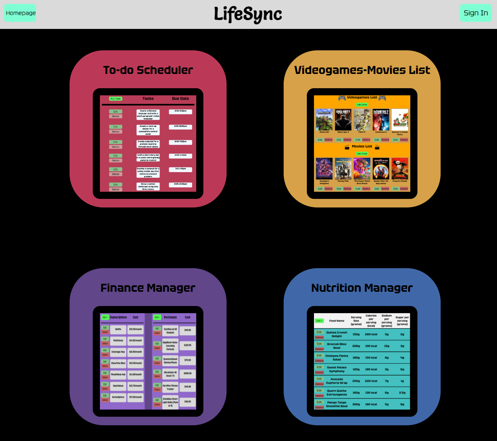

## LifeSync Project Description
 
Hey there! Welcome to LifeSync – the ultimate lifestyle management platform I've crafted with you in mind. Life can get hectic, so I've designed LifeSync to help you seamlessly organize different facets of your daily routine. Packed with a friendly interface and powerful features, LifeSync is your go-to solution for efficient task management, entertainment tracking, financial tracking, and nutrition tracking – all neatly consolidated in one place.

### Key Features:

1. **To-Do Scheduler:**
   Stay on top of your game by compiling a list of tasks with the To-Do Scheduler. Create, edit, and manage your to-do lists effortlessly, ensuring you stay focused on what matters most.

2. **Video Games & Movies List:**
   Keep tabs on your favorite games and movies. LifeSync's Video Games & Movies List lets you track what you've watched or played – it's completely up to the user! The list can contain your favorite games and movies or ones you hope to play or see in the future!

3. **Finance Manager:**
   Take control of your finances – because every penny counts. With the Finance Manager, you can track expenses into two categories: subscriptions and one-time payments you have or want to have! Having that laid out in front of you will give you a better idea of how much money you are spending.

4. **Nutrition Manager:**
   Keep track of your favorite foods and their nutritional facts! You decide the serving size and log the calories, sodium levels, and sugar levels. Having logged that food you can make the decision whether that food falls within your limit for whatever day you want to eat a meal!

### Technologies Used

- Express
- EJS Templates
- Node.js
- MongoDB
- JavaScript
- HTML & CSS
- Google Authentication

### User Stories

- As a user, I want to be able to log in to have my data saved in each of the app's features.
- As a user, I want to easily be able to navigate around the site.
- As a user, I want to be able to edit and delete anything I add to the site.
- As a user, I want to be able to have a way to go to my home page at all times.
- As a user, I want to see a template of how information would be laid out.
- As a user, I want the option to distinguish between each additional information I have.
- As a user, I want the option to add as much info as I want.

### MVP + Stretch Goals

#### MVP Goals

- Have those 4 main routes (not including the forms for each of those routes).
- Forms for each category.
- Google Authentication.
- Display Users' Lists in their respective routes.
- CRUD functionality for each of the mini-apps.

#### Stretch Goals

- A profile page that just displays a user's added lists all on one page (cannot add any from the profile).
- JWT authentication.
- Use something like Bootstrap or Tailwind CSS.
- Pull from APIs for the movie and game list.

### Wireframes

| Homepage                                | To-Do Scheduler                                       |
| --------------------------------------- | ----------------------------------------------------- |
|  |  |

| Video Games & Movies List                                                | Finance Manager                                       |
| ------------------------------------------------------------------------ | ----------------------------------------------------- |
|  |  |

| Nutrition Manager                                         | Forms Example                                       |
| --------------------------------------------------------- | --------------------------------------------------- |
|  |  |
