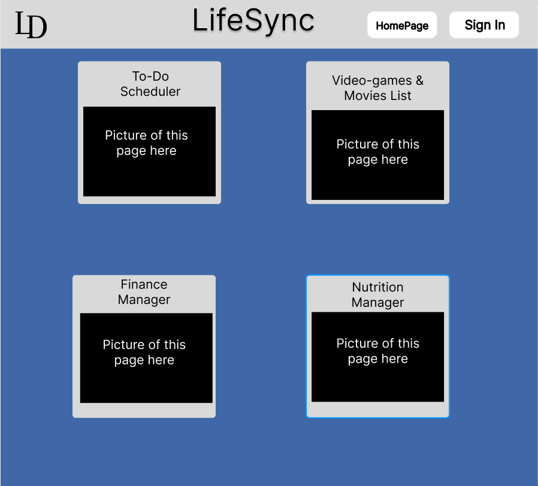
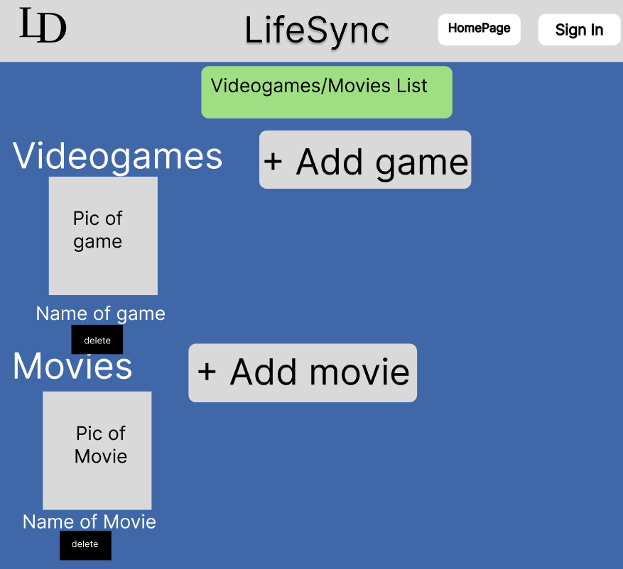
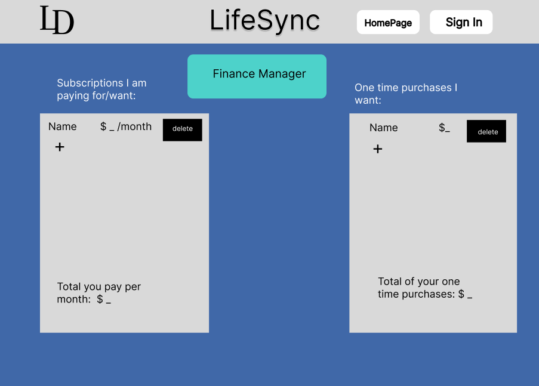

## LifeSync Project Description

Hey there! Welcome to LifeSync – the ultimate lifestyle management platform I've crafted with you in mind. Life can get hectic, so I've designed LifeSync to help you seamlessly organize different facets of your daily routine. Packed with a friendly interface and powerful features, LifeSync is your go-to solution for efficient task management, entertainment tracking, financial planning, and health monitoring – all neatly consolidated in one place.

### Key Features:

1. **To-Do Scheduler:**
   Stay on top of your game by planning your day with the To-Do Scheduler. Create, edit, and manage your to-do lists effortlessly, ensuring you stay focused on what matters most.

2. **Video Games & Movies List:**
   Keep tabs on your favorite games and movies. LifeSync's Video Games & Movies List lets you track what you've watched or played – it's completely up to the user!

3. **Finance Manager:**
   Take control of your finances – because every penny counts. With the Finance Manager, you can track expenses, manage expenses, and make decisions based on those expenses all in one central hub.

4. **Nutrition Manager:**
   Make healthy choices a breeze with the Nutrition Manager. Log your daily intake of calories, sodium, and sugar, and keep yourself on track towards your health and fitness goals.

### Technologies Used

- Express
- EJS Templates
- Node.js
- MongoDB
- JavaScript
- HTML & CSS
- Google Authentication

### Picture of Home Page

_To be created soon_

### User Stories

- As a user, I want to be able to log in to have my data saved in each of the app's features.
- As a user, I want to easily be able to navigate around the site.
- As a user, I want to be able to delete anything I add to the site.
- As a user, I want to be able to have a way to go to my home page at all times.

### MVP + Stretch Goals

#### MVP Goals

- Have those 4 main routes (not including the forms for each of those routes).
- Forms for each category.
- Google Authentication.
- Display Users' Lists in their respective routes.
- CRUD functionality for each of the mini-apps.

#### Stretch Goals

- A profile page that just displays a user's added lists all on one page (cannot add any from the profile).
- JWT authentication.
- Use something like Bootstrap or Tailwind CSS.
- Pull from APIs for the movie and game list.

### Wireframes

| Homepage                                | To-Do Scheduler                                       |
| --------------------------------------- | ----------------------------------------------------- |
|  |  |

| Video Games & Movies List                                                | Finance Manager                                       |
| ------------------------------------------------------------------------ | ----------------------------------------------------- |
|  |  |

| Nutrition Manager                                         | Forms Example                                       |
| --------------------------------------------------------- | --------------------------------------------------- |
|  |  |
